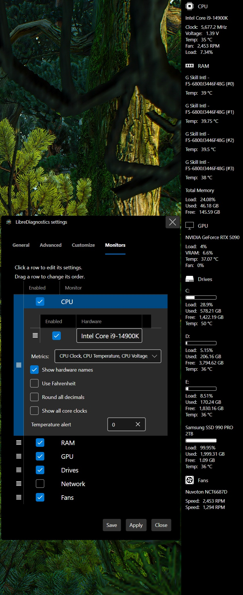
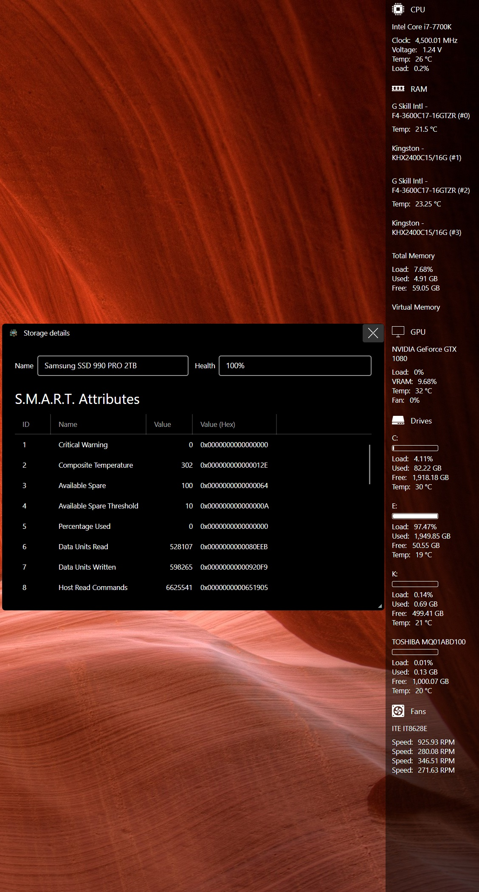

    

<h1 align="center">LibreDiagnostics</h1>

A desktop utility for real-time hardware monitoring and diagnostics.

## Preview of app

Please click on an image to show its full size.

## Features

### Monitoring for your hardware components
- CPU
- GPU
- RAM
- Drives
- Network
- Fans

### Various customization options, such as
- display the app as an app bar (Windows)
- autostart after you initially logged in (Windows)
- docking location[s] on different screens
- adjust application font size & width
- tailor update interval to your needs
- various color options for you to modify
- enable or disable specific monitors, hardware or sensors
- and more !

### S.M.A.R.T. data of your drives
You can show various [S.M.A.R.T.](https://en.wikipedia.org/wiki/Self-Monitoring,_Analysis_and_Reporting_Technology) attributes of your drives,
such as health, temperature, power-on hours and more, by simply clicking on the drives name in the drives monitor.

### Missing something ?
Feel free to create a feature request if you think something would improve your handling of the app. 
Your proposal will be considered and analysed to verify if an implementation is possible. 
Please note that an exact timeframe for a feature cannot be provided.

## Requirements

#### All platforms
- .NET 8 Desktop Runtime 

#### Windows 10+
- [PawnIO](https://pawnio.eu/) (Kernel Driver) - source available on [github](https://github.com/namazso/PawnIO)

## Where can I download it ?
You can download the latest release [from here.](https://github.com/Blacktempel/LibreDiagnostics/releases)

## Updating the app

#### Auto update
If enabled, the application will check for an update upon starting, download and apply it. 
Using the update feature WILL erase all files inside of the directory where this application resides. 
Please be aware of that and don't save anything else beside the application itself in its directory. 
Your config file is saved elsewhere and will not be affected. 
The update will be downloaded directly from the latest release on Github. 
If Github has an issue or is down, the update cannot be downloaded and applied.

#### Manual update
You can also update manually by selecting the update button when opening the menu (right click) on the tray icon in your taskbar. 
The update process will be the same as explained in auto update. 
Downloading the latest release from Github and manually replacing it is also perfectly fine.

## What platforms are supported ?
All of our code is cross-platform and also builds on Linux. 
So far only Windows has been tested, so Linux support is experimental. 
Not all settings and features may be available on other operating systems.

## Supported languages
- English
- German / Deutsch

Feel free to contribute translations for other languages !

## Project overview
| Project | .NET Version[s] |
| --- | --- |
| **[LibreDiagnostics](https://github.com/Blacktempel/LibreDiagnostics/tree/master/LibreDiagnostics)**   Main entry assembly that starts the application. | .NET 8 |
| **[LibreDiagnostics.Language](https://github.com/Blacktempel/LibreDiagnostics/tree/master/LibreDiagnostics.Language)**   Localization resources and translations. Provides resources used in UI text, dialogs and messages. | .NET 8 |
| **[LibreDiagnostics.Models](https://github.com/Blacktempel/LibreDiagnostics/tree/master/LibreDiagnostics.Models)**   Data models and global helpers used across the app (e.g. configuration). Central place for strongly-typed settings and shared model structures. | .NET 8 |
| **[LibreDiagnostics.MVVM](https://github.com/Blacktempel/LibreDiagnostics/tree/master/LibreDiagnostics.MVVM)**   ViewModels and MVVM utilities. Binds models to the UI, implements app logic / state, and supports data flow between monitors and views. | .NET 8 |
| **[LibreDiagnostics.Tasks](https://github.com/Blacktempel/LibreDiagnostics/tree/master/LibreDiagnostics.Tasks)**   Background tasks and services (e.g. GitHub updater logic). | .NET 8 |
| **[LibreDiagnostics.UI](https://github.com/Blacktempel/LibreDiagnostics/tree/master/LibreDiagnostics.UI)**   UI entry and application wiring. Hosts [Avalonia UI](https://avaloniaui.net/) startup, icon setup, and user-facing update prompts. Contains client logic for launching the desktop app. | .NET 8 |
| **[LibreDiagnostics.Updater](https://github.com/Blacktempel/LibreDiagnostics/tree/master/LibreDiagnostics.Updater)**   Standalone updater executable. | .NET 8 |

## Reporting issues
LibreDiagnostics is using existing hardware monitoring libraries and drivers. 
Any issues regarding hardware access (like invalid sensor values) should be reported to the respective project. 
If you find bugs or issues in LibreDiagnostics itself, please open an issue on the repository.

### Used libraries and projects
- https://github.com/LibreHardwareMonitor/LibreHardwareMonitor

#### Verifying sensor issues with LibreHardwareMonitor
You can verify if a sensor issue is related to LibreDiagnostics or LibreHardwareMonitor by using the user interface of LibreHardwareMonitor. 
A good verification step is to check if the same sensor shows the same issue in both applications. 
Please remember that the latest release of LibreHardwareMonitor may be different than the version used in LibreDiagnostics. 
To have a better comparison, you can download Artifacts of a recent master build from ["Actions" on the LibreHardwareMonitor repository](https://github.com/LibreHardwareMonitor/LibreHardwareMonitor/actions) and test with that.

## FAQ
**Q:** Where can I find my config file ? 
**A:** The config file is located in your local application data folder. 
For Windows this would be at: ``%LocalAppData%/LibreDiagnostics/Settings.json``. 

## How can I help improve the project ?
Feel free to give feedback and contribute to our project ! 
Pull requests are welcome. Please include as much information as possible.

## Administrator rights

#### Windows
Some functionality requires administrator privileges to access the data. 
This includes, but is not limited to, Kernel drivers and therefore specific calls to `DeviceIoControl`. 
If forcing the software to start without appropiate rights, functionality may be limited or not work at all.

## License
LibreDiagnostics is free and open source software licensed under MPL 2.0. 
You can use it in private and commercial projects. 
Keep in mind that you must include a copy of the license in your project.
